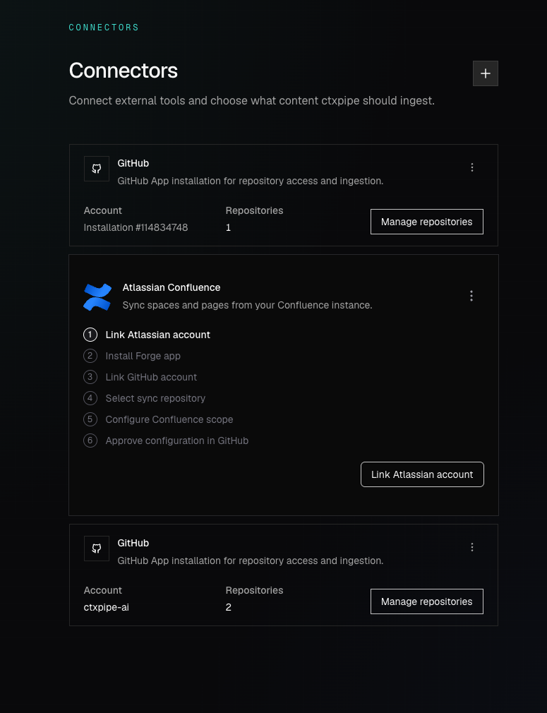
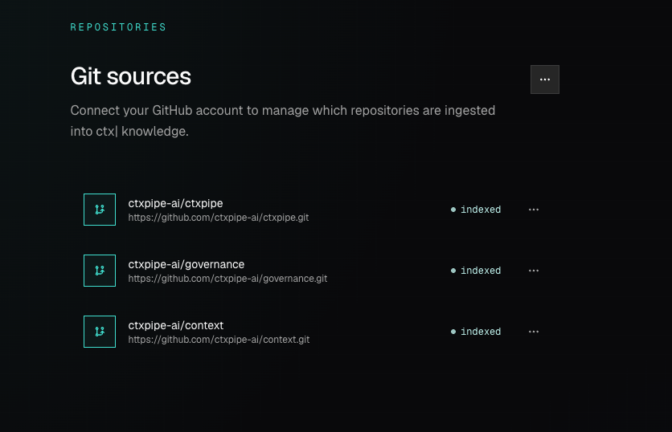
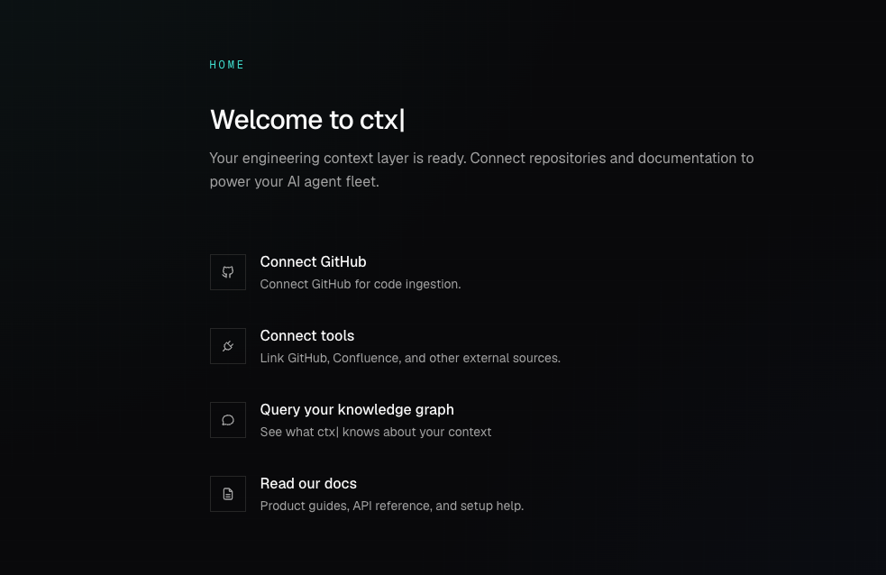

# CTX-104: Bugs in the repo page

Adding and managing repos feels flaky.

In the ctxpipe org ([https://app.ctxpipe.ai/ctx-tev/repositories](<https://app.ctxpipe.ai/ctx-tev/repositories>)), I have connected Git, but the homepage UI shows it's not connected and needs to be done. This is one signal. 

Despite having repos visible in the Repo page, I cannot 'install MCPs via PRs' - that option is not clickable in the menu for me in this account. 

Perhaps this is an issue with connecting multiple repos?







## Comments

### 2026-05-11T09:58:29.313Z · cursor

[**Repo page connection issues**](<https://www.cursor.com/agents/bc-d4da72ed-a1c1-4bab-bb6f-724c31d8906a>)

## Cause

Your instinct about **multiple GitHub connectors** was correct. With more than one GitHub connection on an org, `GET /:orgSlug/api/v1/github/installation` (no `connectionId`) returned **400** with `MULTIPLE_GITHUB_CONNECTIONS_MESSAGE`. The UI helper `fetchGithubInstallationSummary` treats non-OK responses as failure, so TanStack Query never got `installation` data. That cascaded to:

* **Home**: `githubConnected = Boolean(githubInstallation)` stayed false, so the row still looked like “Connect GitHub”.
* **Repositories**: `isDisabled={!installation}` on **Install MCP via PRs**, so the menu item stayed disabled even though repos listed fine (those queries could succeed via different paths or cached/error handling).

## Fix (implemented)

Backend resolution now supports `prefer-primary` (default for reads): when several GitHub connections exist and no `connectionId` is passed, we choose one connector by:

1. **Most indexed repos** in ctx| for that `github_connection_id`
2. Then a row with a non-null GitHub App `installationId`
3. Then **most recently updated**

**Writes stay strict**: **PATCH** and **DELETE** `/github/installation` still use `reject` mode, so they keep returning **400** unless `connectionId` is provided when multiple connectors exist—avoids updating or deleting the wrong connector by accident.

Changes are in:

```427:507:apps/backend/src/models/github-installation.ts
/** When API callers omit connectionId, prefer the GitHub connector that matters most in ctx|. */
export type ResolveGithubInstallationAmbiguousMode =
  | "reject"
  | "prefer-primary"

// ...

export async function pickPrimaryGithubConnectionFromList(
  installations: GitHubInstallationShape[],
): Promise<GitHubInstallationShape | undefined> {
  // ...
}

export async function resolveGithubInstallationForOrgDetailed(
  orgId: string,
  connectionId?: string | null,
  ambiguousMode: ResolveGithubInstallationAmbiguousMode = "prefer-primary",
): Promise<ResolveGithubInstallationResult> {
  // ...
}
```

**Verification:** `pnpm --filter @ctxpipe/backend exec vitest run src/routes/v1/github-installation.test.ts` passes.

**PR:** [https://github.com/ctxpipe-ai/ctxpipe/pull/164](<https://github.com/ctxpipe-ai/ctxpipe/pull/164>)

---

**Sceptical note:** “Primary” is a heuristic. If two connectors tie on repo count and both look equally active, we might not pick the one you’d choose manually. Removing duplicate/stale connectors from **Connectors** is still the clean long-term fix; this change restores sane defaults so the product UI matches reality for the common case (heavy indexing on one connector).

**Repository:** `ctxpipe-ai/ctxpipe`
**Branch:** `cursor/ctx-104-multi-github-primary-resolution-906a`

[View PR](<https://github.com/ctxpipe-ai/ctxpipe/pull/164>) · [Open in Desktop](<https://cursor.com/background-agent?bcId=bc-d4da72ed-a1c1-4bab-bb6f-724c31d8906a>) · [Open in Web](<https://www.cursor.com/agents/bc-d4da72ed-a1c1-4bab-bb6f-724c31d8906a>)

### 2026-05-11T09:53:34.959Z · unknown

This thread is for an agent session with Cursor. [View on Cursor →](https://www.cursor.com/agents/bc-d4da72ed-a1c1-4bab-bb6f-724c31d8906a)
