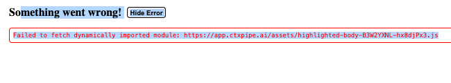

# CTX-105: Session issue after being on chat UI for a while

This bug happened after being on the Chat UI for some hours, inactive.

Refreshing the page solved it, and it returned to the UI.

Are there any background
