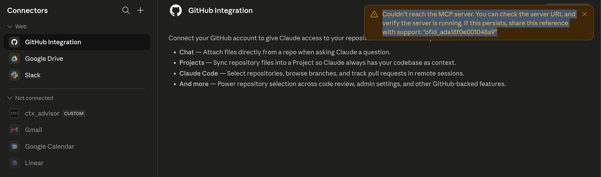
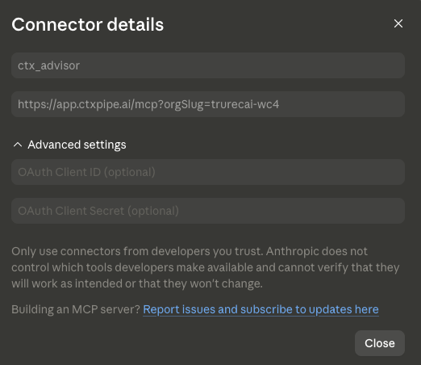

# CTX-108: MCP connection issue with Anthropic (workspace)

When trying to add ctx| connector to Anthropic:

```
Couldn't reach the MCP server. You can check the server URL and verify the server is running. If this persists, share this reference with support: "ofid_ada18f0e001048a9"
```



I am adding an MCP via the 'connector' page in the Claude/Anthropic organisation settings: [https://claude.ai/admin-settings/connectors](<https://claude.ai/admin-settings/connectors>)



Further evidence when trying to call it in a chat:

```
Use the ctx_advisor to help me structure some internal product docs
21:19
Claude responded: I'll help you with that.
I'll help you with that. Let me search for the ctx advisor tool first since it's a connected MCP that I'll need to load.
Searched available tools
Searched available tools
Hmm, that search didn't surface a ctx advisor tool — let me try a different angle.
Loaded tools
Loaded tools
I can see "ctx| advisor" is listed as one of your connected MCP apps, but its tools aren't surfacing through tool_search — which usually means the connection isn't fully active right now (toggled off for this chat, or auth has lapsed).
Two ways forward:
Reconnect ctx| advisor — check Settings → Connectors and make sure it's toggled on for this conversation, then re-send your message. I'll be able to call its tools directly once they're loaded.
Work without it — I'm happy to help structure your internal product docs directly. I can propose an information architecture (overview, specs, runbooks, decisions, FAQs, etc.), draft templates, or restructure existing docs you paste or upload.
Which would you like to do? And if you go with option 2, a bit of context would help: what kind of product, who reads these docs (engineers, PMs, support, customers?), and roughly what you have today.
```

Is this a limitation between the out of the box Anthropic/Claude MCP connector-types (i.e SSE or something?).

Do a deep dive into the Claude docs and compare it to how we have built our MCP to see if there is a compatibility issues or something else.

## Comments

### 2026-05-22T11:31:02.692Z · cursor

[**Anthropic MCP connection**](<https://www.cursor.com/agents/bc-8a2714fd-165d-40a9-a845-81803e2e59d2>)

## Verdict

This is **not** a fundamental “Anthropic only supports SSE” problem. ctx| already implements what Claude’s remote MCP stack expects: **HTTPS Streamable HTTP** at `/mcp`, OAuth with DCR, and public reachability. The issue is a mix of **our discovery/probe behaviour**, **missing OAuth/CORS trust for** `claude.ai`, and **Anthropic’s two-step workspace flow** (admin adds connector → each user must Connect).

I probed production: `https://app.ctxpipe.ai/mcp?orgSlug=trurecai-wc4` returns **401** with `WWW-Authenticate: Bearer resource_metadata="https://app.ctxpipe.ai/.well-known/oauth-protected-resource/mcp"` — the server is up and speaking MCP OAuth.

---

## Compatibility vs Claude docs

| Requirement (Anthropic) | ctx| today |
|-------------------------|-----------|
| Public HTTPS remote MCP | Yes — `app.ctxpipe.ai` |
| Streamable HTTP (preferred) | Yes — `@hono/mcp` `StreamableHTTPTransport` |
| Legacy SSE | Not exposed (not required) |
| OAuth / DCR | Yes — Better Auth `oauthProvider`, `registration_endpoint` |
| Tools only (no prompts/resources in API connector) | Yes — `ctx_advisor` tool |

Anthropic connects from **their cloud** ([support article](<https://support.claude.com/en/articles/11175166-getting-started-with-custom-connectors-using-remote-mcp>)), not the user’s machine. Your URL and transport choice are fine.

---

## What actually went wrong

**1. Pre-OAuth probe got the wrong status**  
`/mcp` validated `orgSlug` *before* auth. A probe to `/mcp` without the query (common during “add connector”) got **400 JSON-RPC**, not **401 + OAuth discovery**. Anthropic’s UI often labels that **“Couldn’t reach the MCP server”** even though the host is reachable.

**2. Path-appended OAuth metadata returned HTML**  
`GET /mcp/.well-known/oauth-protected-resource` hit the SPA, not JSON. Clients that follow RFC 9728 path-appended URLs would fail discovery.

**3.** `claude.ai` **not trusted**  
Production `AUTH_ALLOWED_ORIGINS` was only `https://app.ctxpipe.ai`. Browser-side OAuth steps from Claude need `https://claude.ai` in Better Auth `trustedOrigins` and CORS.

**4. Workspace flow is two steps**  
Saving the org connector (`ctx_advisor` in admin settings) ≠ a live user session. Members must **Customize → Connectors → Connect** and enable the connector in chat. That matches your second screenshot (listed but tools not loading).

**5. Known Anthropic bugs (outside our repo)**

* [HTTP/2 lowercases `WWW-Authenticate`](<https://github.com/anthropics/claude-ai-mcp/issues/219>) — we sit behind Cloudflare HTTP/2.
* [Streamable HTTP tool calls dropped in claude.ai](<https://github.com/anthropics/claude-ai-mcp/issues/123>) — discovery works, execution may not.

---

## Fix shipped

Draft PR: [**https://github.com/ctxpipe-ai/ctxpipe/pull/197**](<https://github.com/ctxpipe-ai/ctxpipe/pull/197>)

* Reorder `/mcp` middleware: **401 OAuth discovery before** `orgSlug` **400** when unauthenticated
* Serve PRM at `/mcp/.well-known/oauth-protected-resource`
* Trust `https://claude.ai` for Better Auth + CORS
* Document Claude workspace setup in MCP docs

After deploy, retry with:

```text
https://app.ctxpipe.ai/mcp?orgSlug=trurecai-wc4
```

Then each user **Connect**s under Customize → Connectors.

---

## What I’d challenge in the original assumption

“Is it SSE vs Streamable HTTP?” — **Unlikely.** SSE is legacy; Anthropic explicitly supports Streamable HTTP. If the connector appears in the sidebar but tools never load, suspect **incomplete per-user OAuth** or **Anthropic proxy bugs**, not transport mismatch.

If it still fails after deploy + Connect, capture whether Anthropic’s probe hits `/mcp` without `orgSlug` and share reference `ofid_ada18f0e001048a9` with Anthropic support — that’s on their proxy path.

**Repository:** `ctxpipe-ai/ctxpipe`
**Branch:** `cursor/mcp-anthropic-connector-compat-59d2`

[View PR](<https://github.com/ctxpipe-ai/ctxpipe/pull/197>) · [Open in Desktop](<https://cursor.com/background-agent?bcId=bc-8a2714fd-165d-40a9-a845-81803e2e59d2>) · [Open in Web](<https://www.cursor.com/agents/bc-8a2714fd-165d-40a9-a845-81803e2e59d2>)

### 2026-05-22T11:21:52.901Z · unknown

This thread is for an agent session with Cursor. [View on Cursor →](https://www.cursor.com/agents/bc-8a2714fd-165d-40a9-a845-81803e2e59d2)
