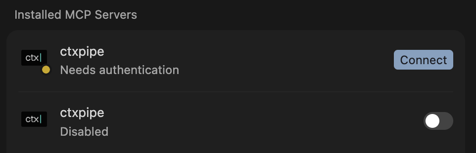

# CTX-136: CLI installs two MCPs, and doesn't seem to authenticate

After a fresh repo install of ctxpipe via npx, two MCPs are installed (remote and local?) but they are not authenticated, so it fails when trying to call it.



```
⚠ MCP client for `ctxpipe` failed to start: MCP startup failed: handshaking with MCP server failed: Send
  message error Transport
  [rmcp::transport::worker::WorkerTransport<rmcp::transport::streamable_http_client::StreamableHttpClientWor
  ker<rmcp::transport::auth::AuthClient<codex_rmcp_client::http_client_adapter::StreamableHttpClientAdapter>
  >>] error: Auth error: OAuth authorization required, when send initialize request
```

However, this happened via the CLI:

```
┌  ctx| setup
│
│  Connect your agents to ctx|
│
◇  Sign-in required
│
◇  Sign in
│
│  Sign in to ctx| so we can load your organizations.
│
◇  Sign-in request ready
│
◇  Open this URL
│
│  https://app.ctxpipe.ai/.auth/device?user_code=XGM7WEBU
```

---

Claude reports this on startup in the repo:

```
For help configuring MCP servers, see: https://code.claude.com/docs/en/mcp
                                                                                   
  [Failed to parse] Project config (shared via .mcp.json)
  Location: /Users/thomaspeterson/Projects/PRDs/.mcp.json                          
   └ [Error] mcpServers.ctxpipe: Does not adhere to MCP server configuration schema
```

## Comments

### 2026-08-15T13:36:24.408Z · tom

Authentication fixed here for both MCPs. However connectivity remains an issue 

### 2026-06-18T02:20:34.330Z · tom

I wonder if it is a callback / sequencing issue when the first MCP is installed (remote), then the local memory addition is bolted on via a new MCP entry, instead of updated the original MCP entry?
