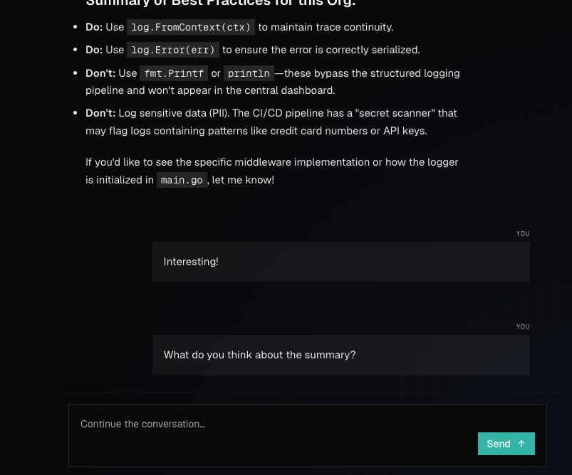
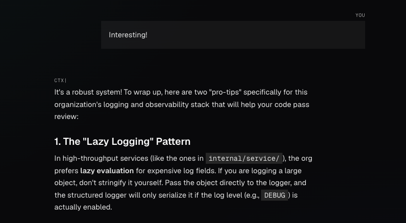

# CTX-37: Chat is not working...! Well kinda...

On prod the chat isn't working - and in local branch for the download + copy code snippet fixes, I get errors, too. See pic.

This sometimes would show after a submitted query:
`No tool invocation found for tool call ID "tool_list_files_HKlhFchTWEPs9eertVIU".`

It then renders the responses WAY after the original submission:

## Comments

### 2026-04-15T11:03:09.635Z · cursor

[**Chat tool invocation error**](<https://www.cursor.com/agents/bc-f68b89de-913f-4d63-97e0-7bc41d56d709>)

## Cause

The message comes from the **AI SDK** (`ai` package), not from your app strings: when the client processes the chat stream, it expects every `tool-output-available` / `tool-output-error` chunk to follow a **tool invocation** it already created with `tool-input-start` (same `toolCallId`). If output arrives first, it throws:

`No tool invocation found for tool call ID "…"`.

In your case the ID looks like `tool_list_files_<suffix>` — a **synthetic** id LangChain uses for tools. `@ai-sdk/langchain` → `toUIMessageStream` can still emit tool **output** for that id even when it never emitted `tool-input-start` for it (e.g. mismatch between streamed `tool_call_chunks` ids and `ToolMessage.tool_call_id`). That aborts stream processing in the UI, so the assistant reply only shows **after** a retry or a later update — matching “WAY after the original submission.”

## Fix (implemented)

A small **post-**`toUIMessageStream` transform on the backend prepends a synthetic `tool-input-start` when we’re about to emit tool output for an id that:

* Was not seen in any prior `tool-input-*` chunk in that stream, and
* Matches `tool_<name>_<opaque>` (same shape as your error), so we can infer `toolName` (e.g. `list_files`).

**PR:** [https://github.com/ctxpipe-ai/ctxpipe/pull/101](<https://github.com/ctxpipe-ai/ctxpipe/pull/101>)

**Tests:** `uiMessageStreamToolInvocationRepair.test.ts` (including the exact `tool_list_files_…` id from the issue).

**Files:** `uiMessageStreamToolInvocationRepair.ts` + `transport.ts` pipes the UI stream through it before `createUIMessageStreamResponse`.

**Repository:** `ctxpipe-ai/ctxpipe`
**Branch:** `cursor/fix-chat-tool-invocation-stream-d709`

[View PR](<https://github.com/ctxpipe-ai/ctxpipe/pull/101>) · [Open in Desktop](<https://cursor.com/background-agent?bcId=bc-f68b89de-913f-4d63-97e0-7bc41d56d709>) · [Open in Web](<https://www.cursor.com/agents/bc-f68b89de-913f-4d63-97e0-7bc41d56d709>)

### 2026-04-15T10:53:13.192Z · jakub

@cursor look into the `No tool invocation found`? what could cause that and how can we fix it
