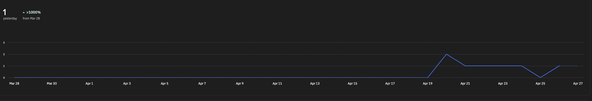

# CTX-81: Segment data on MCP between users and tools, i.e. code reviewers

It would be good to see consumption across users: agents, users (chat), and third party tools using the MCP (if possible).

## Comments

### 2026-04-27T06:03:43.658Z · tom

Today shows a single MCP unique user, when Coderabbit, Codex, myself and a colleague are using it.

